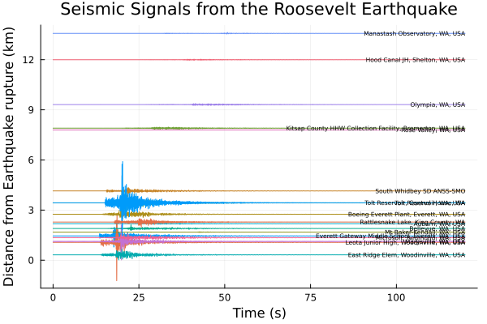
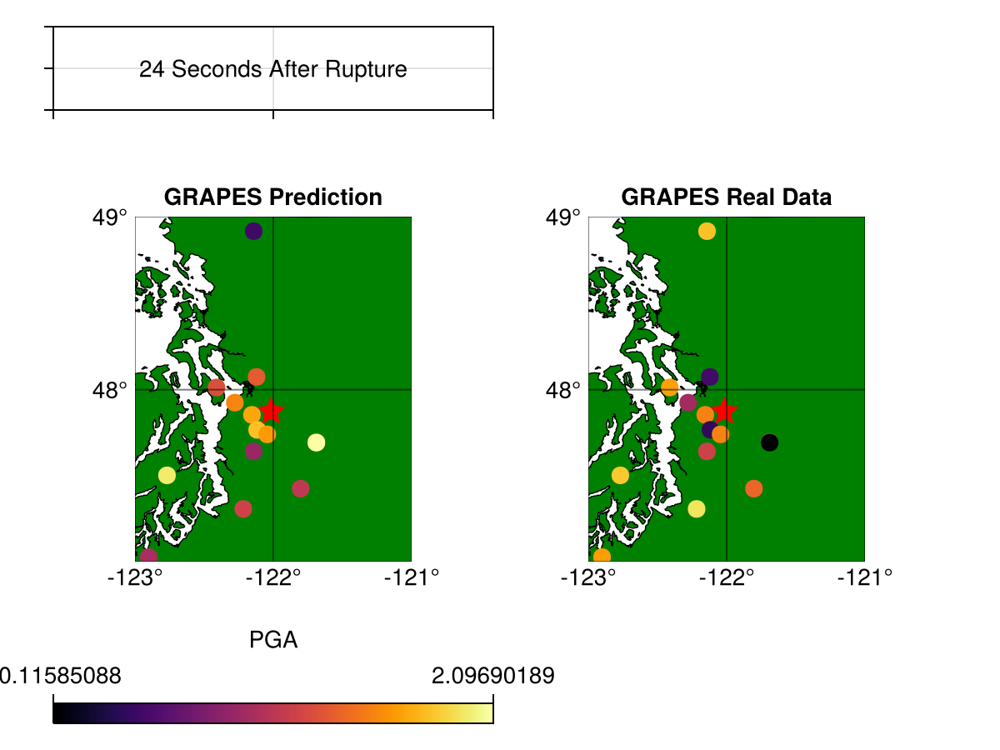
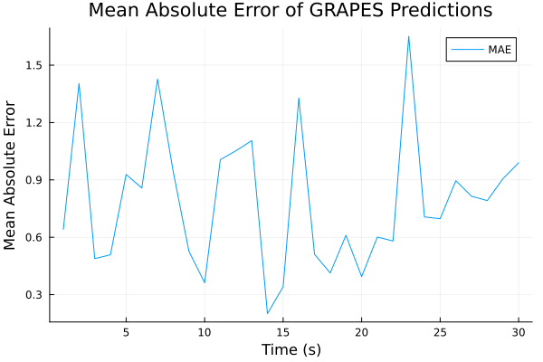

# PNW-GRAPES
GRAPES.jl is a Julia-language code for earthquake early warning, I am using it to predict PNW events.

## Overview
This project is using the GRAPES graph nerual network model made by Tim Clements for the U.S. Geological Survey found [here.](https://code.usgs.gov/esc/grapes.jl) This model can be used in real time with sesimic stations to predict peak ground acceleration (PGA), as an earthquake starts to rupture for earthquake early warning systems (EEWS). This repository shows how to pull Pacific Northwest sesimic events and use GRAPES to predict the PGA, to ultimately see how the model can be applied in other areas it was not trained on.

## Installation
First we need to install a specific version of SeisIO
```julia
pkg> add https://github.com/tclements/SeisIO.jl.git
```
Then to install GRAPES
```julia
pkg> add https://code.usgs.gov/esc/grapes.jl.git
```

## Acquirng Seismic Data
To run GRAPES you need three objects. a `GNNGraph` and three vectors `distance_from_earthquake`, `lon`, `lat`. These are dependant on what station you are gathering the event from. We will be using SeisIO to download the data for GRAPES to run.

### Finding an event
We will be getting the [2019 M4.6 earthquake waveform that occured near Roosevelt, Washington](https://earthquake.usgs.gov/earthquakes/eventpage/uw61535372/executive). From the USGS website we can see what stations caputed the event, for this tutorial I will be using the Everett Gateway Middle School station (EVGW).


### Pulling events into Julia using SeisIO
SeisIO documentation can be found [here.](https://seisio.readthedocs.io/en/latest/index.html)

```julia
using SeisIO

# Get the start and end time in UTC for the event 
ts = "2019-07-12T09:51:30" #time start
te = "2019-07-12T09:53:30" #time end

#Pull Data from multiple stations for single event
S1 = get_data("FDSN","UW.EVGW.",src="IRIS", s=ts,t=te, detrend=true, rr=false, w= true, autoname=true)
S2 = get_data("FDSN", "UW.LEOT", src="IRIS", s=ts, t=te, detrend=true, rr=false, w=true, autoname=true)
S3 = get_data("FDSN", "UW.TOLT", src="IRIS", s=ts, t=te, detrend=true, rr=false, w=true, autoname=true)
S4 = get_data("FDSN", "UW.QBRO", src="IRIS", s=ts, t=te, detrend=true, rr=false, w=true, autoname=true)
S5 = get_data("FDSN", "UW.BEVT", src="IRIS", s=ts, t=te, detrend=true, rr=false, w=true, autoname=true)
S6 = get_data("FDSN", "UW.EARN", src="IRIS", s=ts, t=te, detrend=true, rr=false, w=true, autoname=true)
S7 = get_data("FDSN", "UW.MS99", src="IRIS", s=ts, t=te, detrend=true, rr=false, w=true, autoname=true)
S8 = get_data("FDSN", "UW.SWID", src="IRIS", s=ts, t=te, detrend=true, rr=false, w=true, autoname=true)
S9 = get_data("FDSN", "UW.QGFY", src="IRIS", s=ts, t=te, detrend=true, rr=false, w=true, autoname=true)
S10 = get_data("FDSN", "UW.MBKE", src="IRIS", s=ts, t=te, detrend=true, rr=false, w=true, autoname=true)
S11 = get_data("FDSN", "UW.QKEV", src="IRIS", s=ts, t=te, detrend=true, rr=false, w=true, autoname=true)
S12 = get_data("FDSN", "UW.QOCL", src="IRIS", s=ts, t=te, detrend=true, rr=false, w=true, autoname=true)
S13_station = get_data("FDSN", "UW.MANO", src="IRIS", s=ts, t=te, detrend=true, rr=false, w=true, autoname=true)
S14 = get_data("FDSN", "UW.OHC", src="IRIS", s=ts, t=te, detrend=true, rr=false, w=true, autoname=true)
S15_station = get_data("FDSN", "UW.RVW2", src="IRIS", s=ts, t=te, detrend=true, rr=false, w=true, autoname=true)
S16 = get_data("FDSN", "UW.KIMR", src="IRIS", s=ts, t=te, detrend=true, rr=false, w=true, autoname=true)
S17 = get_data("FDSN", "UW.TLW1", src="IRIS", s=ts, t=te, detrend=true, rr=false, w=true, autoname=true)
S18_station = get_data("FDSN", "UW.RATT", src="IRIS", s=ts, t=te, detrend=true, rr=false, w=true, autoname=true)
```
## If the stations use instruments you do not want to use, you can extract the channels by
``` julia
S7 = pull(S7_channels, 1:3) 
#this is pulling the 1st 2nd and 3rd channel from an arbitrary S7_Channel
```
GRAPES uses multiple channels for its prediction. The more the better! I am currently using 54 channels from 18 different SeisData objects, so for convience we will push them all into 1 object "S"!

```julia
#Push all the channels into one
S = SeisData(S1,S2,S3,S4,S5,S6,S7,S8,S10,S11,S12,S14,S15,S16,S17,S18) #, Sn)
```

## Data Preprocessing
First we need to remove the gain from the signal. This comes from the transition from a physical sensor into computed values, then insure all signals are in m/s^2, so we will run the following for loop to divide the signal by its gain value and check if it is in m/s and if so take the time derivative.

```julia
#Remove Gain from the stations
for i in 1:length(S)
    println("Before division:")
    println("Gain: ", S[i].gain)
    println("First 3 x values: ", S[i].x[1:3])

    newS = S[i]
    newS.x = newS.x ./ newS.gain
    # Create a new SeisData object with the modified x values
    #new_S = SeisData(S[i].x ./ S[i].gain)


    if newS.units == "m/s"
        # Take the derivative of S[i].x
        derivative = diff(newS.x)

        # Append a zero at the end to keep the same length
        derivative = vcat(derivative, 0) * S[i].fs

        # Replace S[i].x with its derivative
        newS.x = derivative
    end
    S[i] = newS
    println("After division:")
    println("First 3 x values: ", S[i].x[1:3])
end
```
This will display values before and afer removing the gain so you can make sure it is right. The values should be to the ^-6.

## Setting up GRAPES
Now the model needs some parameters for the event. The numbers are taken from GRAPES' test procedure.
```julia
#Source parameters for M4.6 Roosevelt, WA EQ
origin_time = DateTime(2019, 7, 12, 9, 51, 38)
event_location = EQLoc(lat= 47.873, lon= 122.016, dep=28.8)
sample_time = origin_time + Second(6)
# parameters for GRAPES model
rawT = 4.0 # second of input window
predictT= 60.0 # seconds to extract future PGA
k = 10 # nearest neighbors when i did 20 it gave me (k < Nrows)
maxdist = 30000.0 # meters (meters from or of what?)
logpga = true # return try PGA in log10(pga [cm/s^2])
```

RawT is the input window for the model, how much space you are giving the model to make a prediction. The K controls the nearest neighbor, this is very important because if you do not have many channels you will need to reduce or else they will all be connected and causing an error.

Then to contain my input_graphs (the true values) my predictions from the model, longitude and latitude values for each station I create the following arrays

```julia
input_graphs = Array{GNNGraph}(undef, 30)
N = length(input_graphs)
preds = Array{GNNGraph}(undef, N)
lon_vals = Array{Vector{Float64}}(undef, 1)
lat_vals = Array{Vector{Float64}}(undef, 1)
```
These will be very useful for all graphing needs later on.

### Running Grapes

Then for the for loop, instead of batching the data like Tim does in his paper, We decided to run a for loop since we are only doing a single event. For this we want to be increases in each increment the sample_time, see below:

```julia
for ii in 1:N
    sample_time = origin_time + Second(ii*3)
    g, distance_from_earthquake, lon, lat = generate_graph(
        S, 
        rawT, 
        predictT, 
        event_location, 
        sample_time, 
        k=k, 
        maxdist=maxdist, 
        logpga=logpga, 
    )
    input_graphs[ii] = g
    preds[ii] = model(input_graphs[ii])
    lon_vals = lon
    lat_vals = lat
end
```

This appends values for each array we created before, the input_graph and preds are tensors with the first dimension being the number of stations, make sure these match. To validate your results this code will give us a quick way to measure the difference between GRAPES predicited value and the actual value from the Roosevelt event.

## MAE Calculation
```julia
#Validate Predictions
mae = []
for i = 1:30
    differences = abs.(vec(preds[i].ndata.x) .- vec(input_graphs[i].gdata.u))
    push!(mae, mean(differences))
end
```
This creates an empty array "mae" for Mean Absolute Error, the loop goes through each time interval and gives you the mae to then be pushed into the array for ease of plotting.


### Plotting the events
I used Makie and GeoMakie for plotting, the state JSON file was made graciously by [Steven Walters](https://environment.uw.edu/faculty/steven-walters/), thank you so much again!

I will show how to plot the prediction values:
First you need to establish the canvas and geoaxis
```julia
using Makie, GeoMakie
fig = figure() #creates a blank canvas
ga = GeoAxis(
    fig[1,1], width = Relative(1), height = Relative(1.5); 
    dest = "+proj=comill", title ="GRAPES Prediction") 

```
    
This creates our canvas and GeoAxis, the dest chooses the projection type. Now we create a polygon of the JSON file previously mentioned here

```julia
# load the state boundary data given by Steven Walters
state = GeoJSON.read(read(".\\PNW-GRAPES\\wa_state_bnd.json", String))
poly!(ga, state; strokewidth = 0.7, color=:green, rasterize = 5)
```
And now pick a specific time spot for when you want to plot, I am doing 25 or 75 Seconds after rupture.

```julia
# Get the values from preds[whatever index you want to plot]
pred_values = preds[25].ndata.x

# Create a color map
using ColorSchemes
color_map = ColorSchemes.inferno

# Get the range of pred_values for colorrange
pred_range = (minimum(pred_values), maximum(pred_values))
cbar_p_range = [minimum(pred_values),maximum(pred_values)]
cbar_p_labels = string.(cbar_p_range)
#plot prediction data
for i in 1:length(pred_values)
    x = lon_vals[i]
    y = lat_vals[i]
    Makie.scatter!(ga, x, y, color=pred_values[i],colormap=color_map, colorrange=pred_range, markersize=10, marker=:circle, label = "Station", rasterize = 5)
end
Makie.Colorbar(fig[1, 2], label = "Predicted PGA", ticks = cbar_p_range, limits = cbar_p_range) #, width = Relative(0.1), height = Relative(0.8)
fig
```
This will then give you a plot of the GRAPES predictions with a color_map of your choosing!

## plot_grapes
For ease of use I made a plot_grapes function, it needs `preds`, `lon_vals`, `lat_vals`, `event_location`, and `input_graphs`. These all should be made already if following my steps / repository.

This function creates a real vs predicited PGA plots for each time interval. It is all pushed onto an array `grapes_figs`.

## Results

To see the best time to compare predicted and real values, I made a chart showing the seismic signal at each station over the time. See below



We can see at around 23 seconds most stations are picking up a signal, so we will compare the values at 24 seconds. Using the function plot_grapes I produced this plot.



The stations seem to be over predicting and under predicting, now looking at the MAE plot:



We can see a very large MAE value at 24 seconds.

## Conclusions
There is still much work to be done on this model! GRAPES requires a high station count to allow more neighbors in the set up of the model. With preprocessing already set up and put into a function with a little more time and adding more stations I predict there would be better more accurate results. Over the summer I will update this repository with many more channels and I assume there will be a much nicer, more accurate prediction being made by GRAPES.

Many thanks to Timothy Clements and Steven Walters for their contributions to my project and thank you to Marine Denolle for advising me and helping me with this throughout the quarter!


## Publications
T. Clements et al (Paper is not published yet)